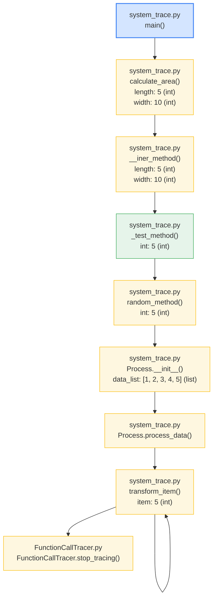

# Function Call Diagram

```mermaid
flowchart TD
    func0__test_method["system_trace.py<br>_test_method()<br>int: 5 (int)"]
    func1_transform_item["system_trace.py<br>transform_item()<br>item: 5 (int)"]
    func2_Process.init["system_trace.py<br>Process.__init__()<br>data_list: [1, 2, 3, 4, 5] (list)"]
    func3_iner_method["system_trace.py<br>__iner_method()<br>length: 5 (int)<br>width: 10 (int)"]
    func4_calculate_area["system_trace.py<br>calculate_area()<br>length: 5 (int)<br>width: 10 (int)"]
    func5_Process.process_data["system_trace.py<br>Process.process_data()"]
    func6_random_method["system_trace.py<br>random_method()<br>int: 5 (int)"]
    func7_FunctionCallTracer.stop_tracing["FunctionCallTracer.py<br>FunctionCallTracer.stop_tracing()"]
    func8_main["system_trace.py<br>main()"]
    func8_main --> func4_calculate_area
    func4_calculate_area --> func3_iner_method
    func3_iner_method --> func0__test_method
    func0__test_method --> func6_random_method
    func6_random_method --> func2_Process.init
    func2_Process.init --> func5_Process.process_data
    func5_Process.process_data --> func1_transform_item
    func1_transform_item --> func1_transform_item
    func1_transform_item --> func7_FunctionCallTracer.stop_tracing

    %% Styling
    classDef default fill:#f9f9f9,stroke:#333,stroke-width:1px
    classDef mainMethod fill:#d4e5ff,stroke:#4285f4,stroke-width:2px
    classDef utilMethod fill:#e6f4ea,stroke:#34a853,stroke-width:1px
    classDef privateMethod fill:#fef7e0,stroke:#fbbc05,stroke-width:1px
    classDef initMethod fill:#fce8e6,stroke:#ea4335,stroke-width:1px
    class func0__test_method utilMethod
    class func1_transform_item privateMethod
    class func2_Process.init privateMethod
    class func3_iner_method privateMethod
    class func4_calculate_area privateMethod
    class func5_Process.process_data privateMethod
    class func6_random_method privateMethod
    class func7_FunctionCallTracer.stop_tracing privateMethod
    class func8_main mainMethod
```
